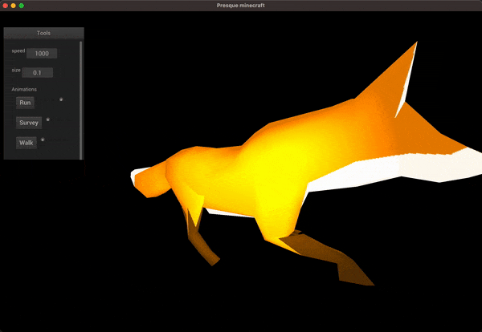

# GLSScene
3D graphical engine using openGL and openCL interoperability written in C++


### external libraries

**stb_image** (https://github.com/nothings/stb.git): loading images assets

**assimp** (https://github.com/assimp/assimp): loading scenes assets like 3d models and animations

**glfw** (https://github.com/glfw/glfw): window & input framework

**nanogui** (https://github.com/wjakob/nanogui.git): a GUI library to use with openGL that creates interfaces (such as text, button, textfield, etc...) on the screen

**nlohmannjson** (https://github.com/nlohmann/json): parsing of json files

> Note: glfw, nanogui and nlohmannjson are only used to show scene examples. The core graphic engine is usable with any other window framework like SDL or SFML

## Presentation


This project is used as a playground to try out things that I learn with openGL. I'm trying to make everything as inter compatible components.

The structure of a scene is a bit inspired from the gltf file format organization.
* Everything in the scene is a node that has a location, scale and rotation.
* Nodes are organized as tree graph. They have a parent node and a list of children nodes.
* The transformation (translation, scale and rotation) of a parent node will recursively apply to all childrens.
* A node can have a list of renderable components like a mesh, particle system or skinned mesh.

The engine is independent from the window management. It is only used to render a frame. The render loop is a behavior that should be implemented from the window management system.

### Casting shadows


In this scene there are multiple elements that are drawn on the same image to test the compatibility of drawing between different objects:
* Some static meshes like the white plane and a textured sphere
* One textured cube that rotates with time using a rotation matrix
* Ten thousands of small cubes with different translations, scales and rotations revolving around a pivot point. The rendering is optimized using instanciated mesh
* A particle system rendering thousands of particles floating around
* A spotlight moving and casting shadow for all elements
* An outliner effect for the spotlight using custom stencil and post rendering

To cast a shadow, elements have two ways of rendering. One that behaves using multiple elements in a scene like lights, texture or camera orientation. And another to render in a depth buffer to have a much quicker render so a light caster can render a scene quickly.

### Loading external assets


This previous scene contains a skybox and a static mesh loaded from external file asset using assimp.

The skybox is rendered using a sampler cube on a texture cube map. The render is a basic cube but unlike every other elements of a scene, it ignores the camera translation and scale but only uses the rotation to give the background effect.

### Particles system


  

There is a small module in the engine that manages openCL functionalities. One of those functionalities is to create a buffer shared by OpenCL and OpenGL. Ideal to create particle systems.

Those are rendered using a cloud of dots and updated with an openCL kernel applied to each of the particles.

The power of the GPU parralelization allows it to render and update millions of particles in real time with a correct 60 fps.

A particle kernel has two functions. One to initialize the particles so we can begin with a desired shape or color. And the other to update particles data with a given delta time.

We can also apply a texture to the particles. This will make the rendering pipeline use a geometry shader to turn a dot into a square.


### Skinned mesh



The engine can render skinned meshes with skeletal animation and blend multiple animations inside single skeletal mesh.

The skeleton has different articulations which can be moved and rotated using manual or pre defined animation with custom speed. We can cover the skeleton with the skin which follows the skeleton bones.

### Voxel engine

One of the goal of this project was to play with procedural generation in a voxel world like minecraft.

The code of the procedural generation is contained in an openCL kernel so we can generate chunks of the world in parralel. As a small chunk of 128 blocks width has a size of two millions blocks (128^3 = 2 097 152), a `for` loop on the CPU would be pretty heavy.

Here are some presentations of the generation algorithm from `assets/voxelProceduralGeneratorSources/default.cl`


### Postprocess effects

After the image is rendered to the framebuffer, we can apply a postprocess effect.

Some examples are in assets/postProcessEffects

```
./game -scene shadow -diffuse assets/textures/brickwall.jpg -normal assets/textures/brickwall_normal.jpg -effect assets/postProcessEffects/*effect*.glsl
```

> Averaging the colors to a greyscale to make tthe image black and white


> Procedurally generated fog above the image


> Using truncated colors and color edge detections to make a drawing effect


> As the position of the camera is sent to the post process shader, we can imagine many thing even unrelated to our scene. Like drawing a 3D fractal calculated with a ray marching algorithm above our scene.

